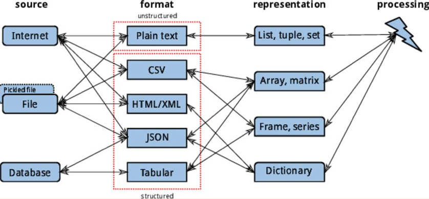

# Python para Análise de Dados

Pipeline de Aquisição de Dados em Python    

# Python - Estruturas básicas para Análise de Dados
1. Lista
2. Tupla
3. Dicionário
4. Array, matriz (pacote Numpy, Scipy)
5. Dataframes, Series (pacote Pandas)
6. Strings
7. List compreension
8. Map/Reduce

# Python - Pacotes Básicos
1. Numpy  
Pacote fundamental que suporta arrays e matrizes multidimensionais, possuindo uma larga coleção de funções matemáticas para trabalhar com estas estruturas   
2. Pandas   
Pacote para manipulação e análise de dados. Em particular, oferece estruturas de dados e operações para manipular tabelas numéricas e séries temporais.   
3. Scipy   
É uma biblioteca Open Source em linguagem Python que foi feita para matemáticos, cientistas e engenheiros.   

# Python - Pacotes para Análise de Dados
1. Scikit-learn (Machine Learning)
2. Statsmodels (Estatística)
3. Matplotlib (Gráficos)
4. Seaborn (Gráficos)
5. ggplot2 (Gráficos)
6. Geopandas (Mapas com Dataframes)
7. Folium (Mapas)

# Cursos de Python para análise dados

Recomendo o curso da DataScienceAcademy (Gratuito e completo)  
Python fundamentos para a análise de dados  
https://www.datascienceacademy.com.br/path-player?courseid=python-fundamentos

Tutorial Points:  
http://www.tutorialspoint.com/python/python_quick_guide.htm

Pandas:  
http://pandas.pydata.org/pandas-docs/stable/10min.html

